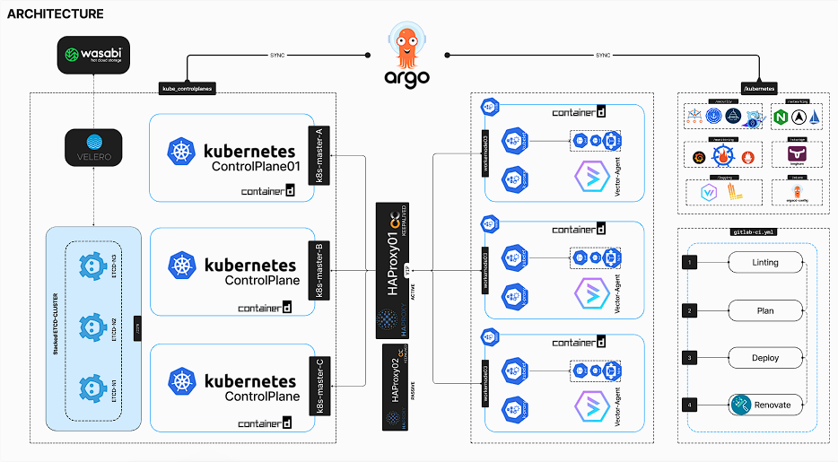

<div align="center">
  
#   KUBEGOROS  
Simplifying the deployment of Bare-Metal Kubernetes cluster in a GitOps fashion 🚀
</div>

---
##   What's this?

A GitOps-based tool leveraging ArgoCD, Ansible and kubeadm for streamlined deployment of production-grade bare-metal Kubernetes clusters. Enables easy and declarative management for streamlined infrastructure oversight.

---
##  Architecture

---
##  Features

- 📦 Declarative deployment of production-ready bare-metal Kubernetes clusters.
- 🛠️ GitOps-based approach for managing Kubernetes apps.
- 🔄 Streamlined provisioning and management of clusters.
- 🚀 Simplified application deployment and configuration.
- 🔧 Customizable configurations for specific use cases.

---

##  Prerequisites

Before getting started, ensure you have:
```
- Ansible >= 2.14
- Python  >= 3.6

```
---

##  Installation

Follow these steps to install:
```
1. git clone https://gitlab.com/chxmxii/cluster-template-coralio
2. task env:install 
```
---
##  Project Strcuture

```md
📁 coralio-cluster-template
├── 📁 kubernetes                # Kubernetes directory
|   ├── 📁 argocd                # ArgoCD Root app
|   └── 📁 apps                  # Cluster applications
└── 📁 ansible                   # Ansible directory 
|   ├── 📁 playbooks             # Ansible playbooks
|   ├── 📁 roles                 # Ansible roles
|   └── 📁 tests                 # Ansible tests
└── 📁 .taskfiles                # Taskfiles directory
    ├── 📄 ansible.yml           # Tasks specific to cluster management with ansible
    └── 📄 env.yml        # Tasks related to environement setup

```
---
##  Stack
<table>
    <tr>
        <th>Logo</th>
        <th>Name</th>
        <th>Description</th>
    </tr>
    <tr>
        <td></td>
        <td><a href="https://www.ansible.com">Ansible</a></td>
        <td>Automate bare metal provisioning and configuration</td>
    </tr>
    <tr>
        <td></td>
        <td><a href="https://argoproj.github.io/cd">ArgoCD</a></td>
        <td>GitOps tool built to deploy applications to Kubernetes</td>
    </tr>
    <tr>
        <td></td>
        <td><a href="https://cert-manager.io">cert-manager</a></td>
        <td>Cloud native certificate management</td>
    </tr>
    <tr>
        <td></td>
        <td><a href="https://www.projectcalico.org">Calico</a></td>
        <td>eBPF-based Networking, Observability and Security (CNI, LB, Network Policy, etc.)</td>
    </tr>
    <tr>
        <td></td>
        <td><a href="https://prometheus.io">Prometheus</a></td>
        <td>Systems monitoring and alerting toolkit</td>
    </tr>
    <tr>
        <td></td>
        <td><a href="https://vector.dev">Vector</a></td>
        <td>High-performance observability data router</td>
    </tr>
    <tr>
        <td></td>
        <td><a href="https://grafana.com/oss/loki">Loki</a></td>
        <td>Log aggregation system</td>
    </tr>
    <tr>
        <td></td>
        <td><a href="https://www.vaultproject.io">Vault</a></td>
        <td>Secret management and data protection</td>
    </tr>
    <tr>
        <td></td>
        <td><a href="https://kyverno.io">Kyverno</a></td>
        <td>Kubernetes Native Policy Management</td>
    </tr>
    <tr>
        <td></td>
        <td><a href="https://istio.io">Istio</a></td>
        <td>Service mesh for connecting, securing, and managing microservices</td>
    </tr>
    <tr>
        <td></td>
        <td><a href="https://kubearmor.io">KubeArmor</a></td>
        <td>Kubernetes Native Runtime Security</td>
    </tr>
    <tr>
        <td></td>
        <td><a href="https://metallb.org">MetalLB</a></td>
        <td>Bare metal load-balancer for Kubernetes</td>
    </tr>
    <tr>
        <td></td>
        <td><a href="https://www.nginx.com">NGINX Ingress Controller</a></td>
        <td>Kubernetes Ingress Controller</td>
    </tr>
    <tr>
        <td></td>
        <td><a href="https://longhorn.io">Longhorn</a></td>
        <td>Cloud native distributed block storage for Kubernetes</td>
    </tr>
    <tr>
        <td></td>
        <td><a href="https://velero.io">Velero</a></td>
        <td>Backup and disaster recovery solution for Kubernetes clusters</td>
    </tr>
</table>


---
##  Usage

Once installed and configured, use taskfile to deploy and manage your Kubernetes cluster:

```bash
$ task help #to view a list of availabe commands
$ task cluster:init #to init the cluster
```
---

##  Roadmap

- Coming soon

---
## Contributing

Contributions are welcome! To contribute to KUBE-X, follow these guidelines:

1. Fork the repository.
2. Create a new branch.
3. Make your changes.
4. Test your changes thoroughly.
5. Submit a pull request.

---

## License

KUBE-X is licensed under the  GPLv3 License. See the [LICENSE](LICENSE.md) file for details.


